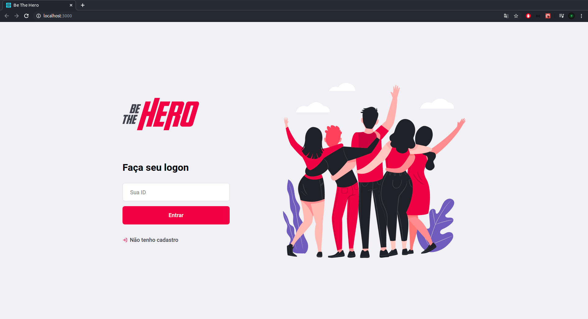
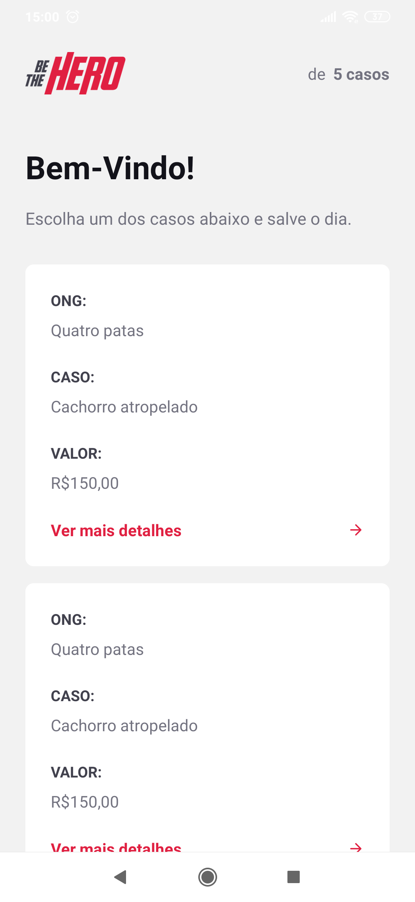
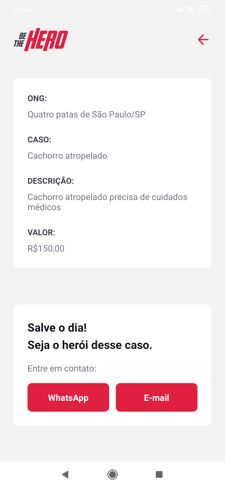

<h1 align="center">
  
  <h1>BeTheHero</h1>
</h1>

## 💻 WEB

<h2>
  
</h2>

## 📱 Mobile

<h2>

</h2>

## 🚀 Tecnologias

Esse projeto foi desenvolvido com as seguintes tecnologias:

Backend:
- [Node.js](https://nodejs.org/en/)
- [Express](https://expressjs.com/pt-br/)
- [Knex](http://knexjs.org/)
- [Nodemon](https://nodemon.io/)
- [Jest](https://jestjs.io/)

Frontend:
- [ReactJS](https://pt-br.reactjs.org/)
- [Styled Components](https://styled-components.com/)
- [Axios](https://github.com/axios/axios)
- [Yup](https://www.npmjs.com/package/yup)
- [React icons](https://react-icons.netlify.com/#/)
- [React toastify](https://github.com/fkhadra/react-toastify)
- [React router dom](https://www.npmjs.com/package/react-router-dom)

Mobile:
- [React Native](https://reactnative.dev/)
- [Expo](https://expo.io/)
- [MailComposer](https://docs.expo.io/versions/latest/sdk/mail-composer/)
- [React Navigation](https://reactnavigation.org/)
- [Styled Components](https://styled-components.com/)
- [Axios](https://github.com/axios/axios)
